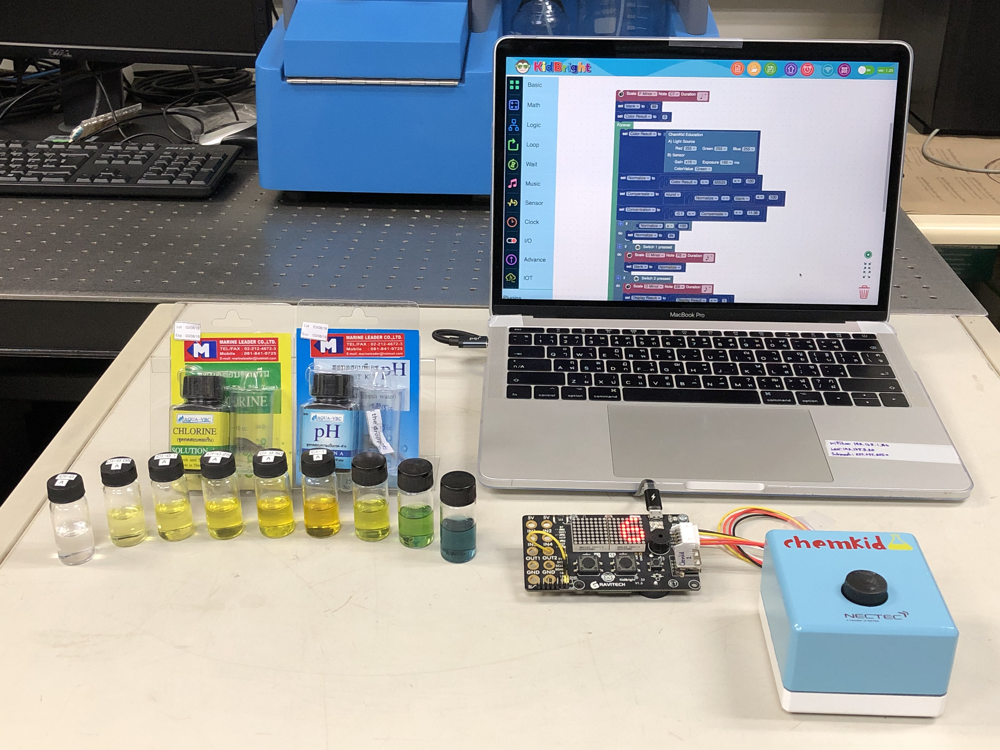
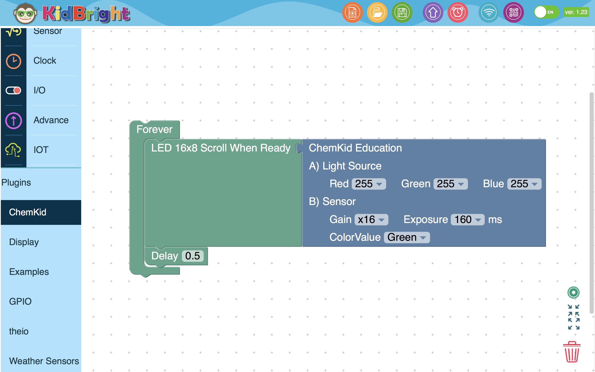
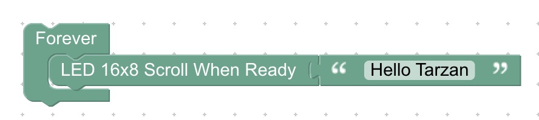
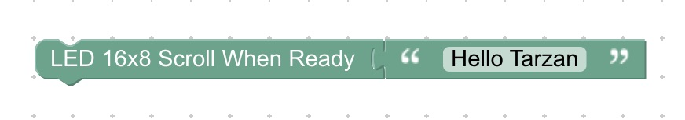
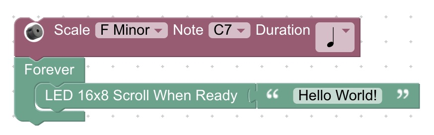
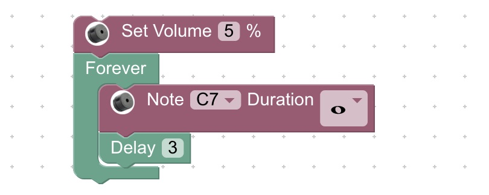

# ChemKidBlock
My Blockly-Code Samples (Beta Version)

**LAB 0 - การเขียน Blockly ที่เป็นพื้นฐานการใช้งานบอร์ด KidBright สามารถศึกษา Code ได้ดังตัวอย่าง**
- 0 Basic - Forever.bin
- 0 Basic - ForeverNo.bin
- 0 Basic - Hello.bin แสดงข้อความบนจอ LED ของบอร์ด KidBright
- 0 Clock - DateTime.bin แสดงวันเวลาบนจอ LED
- 0 Logic - Key Pressed.bin แสดงการใช้ปุ่มกด
- 0 Music - Note.bin แสดงเสียงโน๊ตดนตรีและการคุมความดังของเสียง
- 0 Sensor - Light Level Sensor.bin แสดงการอ่านและแสดงความเข้มแสงจากเซนเซอร์แสง

**LAB 1 - การควบคุม LED สามารถกำหนดความสว่าง 0-255 ระดับ โดยเปิดพร้อมกัน หรือเปิดดวงเดียว ได้ดังตัวอย่าง**
- 1 CK - LED_Red.bin
- 1 CK - LED_Green.bin
- 1 CK - LED_Blue.bin
- 1 CK - LED_Red_Green_Blue.bin

**LAB 2 - การอ่าน Sensor สามารถอ่านค่าของความเข้มแสง (Intensity) 0-65535 ระดับ หรือ 16 บิท ของ Sensor สีแดง สีเขียว สีน้ำเงิน หรือสีขาว ได้ดังตัวอย่าง**
- 2 CK - Sensor_Red.bin
- 2 CK - Sensor_Green.bin
- 2 CK - Sensor_Blue.bin
- 2 CK - Sensor_White.bin

**LAB 3 - การคำนวณค่าดิบของค่าความเข้มแสง (Intensity) 0-65535 ระดับ ของ Sensor ให้เป็นค่าเปอร์เซนต์ของค่าดังกล่าว ได้ดังตัวอย่าง (ตัวอย่างเป็นค่าของ Color Value สีน้ำเงิน)**
- 3 CK - Blue_Percent.bin
- 3 CK - Blue_Percent100.bin
- 3 CK - Blue_PercentRoundTo100.bin
- 3 CK - Blue_PercentRoundTo100Scroll.bin จะแสดงข้อความแบบเลื่อนเมื่อ x มีค่าเกิน 43
- 3 CK - Blue_PercentRoundTo100ScrollDependKey.bin จะแสดงข้อความแบบเลื่อนเมื่อมีการกด Key1

**LAB 10 - การคำนวณเพื่อประยุกต์ใช้งาน ในการวัดสารเคมีต่างๆ ในน้ำ สามารถสร้างการสอบเทียบ (จะได้กล่าวต่อไป) และเมื่อได้สมการแล้วนำสมการมาใส่ลงในโปรแกรมได้ดังตัวอย่าง**
- ตัวอย่าง Coding Chlorine (Para).bin
- ตัวอย่าง Coding pH (Marine).bin

> อุปกรณ์และส่วนประกอบของ ChemKid เครื่องอ่านสีสารละลาย 

> โปรแกรม บล็อกของ ChemKid อย่างง่าย

> โปรแกรม บล็อกของ 0 Basic - Forever.bin

> โปรแกรม บล็อกของ 0 Basic - ForeverNo.bin

> โปรแกรม บล็อกของ 0 Basic - Hello.bin

> โปรแกรม บล็อกของ 0 Clock - DateTime.bin

> โปรแกรม บล็อกของ 0 Logic - KeyPressed.bin

> โปรแกรม บล็อกของ 0 Music - Note.bin

> โปรแกรม บล็อกของ 0 Sensor - Light Level Sensor.bin

